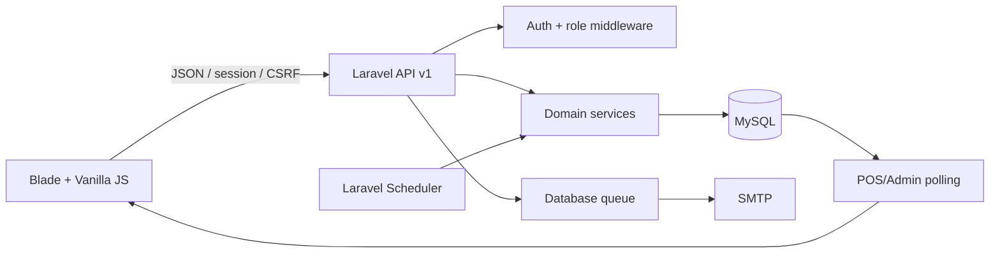

# Đồng lầy Fishing

Ứng dụng POS và quản trị vận hành cho mô hình kết hợp quán cà phê và hồ câu cá. Hệ thống dùng Laravel 13, MySQL, Blade, Vite và Vanilla JavaScript; giao diện tiếng Việt được tối ưu cho iPad, desktop và điện thoại.

## Mục lục

- [Chức năng](#chức-năng)
- [Vai trò và đăng nhập](#vai-trò-và-đăng-nhập)
- [Nghiệp vụ quan trọng](#nghiệp-vụ-quan-trọng)
- [Khu vực quản trị](#khu-vực-quản-trị)
- [Kiến trúc](#kiến-trúc)
- [Yêu cầu hệ thống](#yêu-cầu-hệ-thống)
- [Cài đặt](#cài-đặt)
- [Cấu hình](#cấu-hình)
- [Chạy ứng dụng](#chạy-ứng-dụng)
- [Tài khoản mẫu](#tài-khoản-mẫu)
- [API](#api)
- [Queue và scheduler](#queue-và-scheduler)
- [Sao lưu và xóa dữ liệu](#sao-lưu-và-xóa-dữ-liệu)
- [Kiểm thử](#kiểm-thử)
- [Triển khai production](#triển-khai-production)
- [Xử lý sự cố](#xử-lý-sự-cố)
- [Phạm vi hiện tại](#phạm-vi-hiện-tại)

## Chức năng

### POS cà phê

- Hiển thị sơ đồ bàn với trạng thái trống, đang phục vụ, đã thanh toán và tạm nghỉ.
- Tạo đơn tại bàn hoặc đơn tại quầy; đơn tại quầy có thể được gán bàn sau.
- Tìm kiếm, lọc nhóm, gọi món, thay đổi số lượng và ghi chú từng dòng.
- Hỗ trợ món có giá cố định hoặc giá nhập tại thời điểm gọi món.
- Lưu đơn để tiếp tục phục vụ hoặc chuyển sang thanh toán.
- Thanh toán toàn bộ hay chọn số lượng cụ thể trên từng dòng món.
- Giữ bàn sau khi thanh toán cho đến khi nhân viên chủ động giải phóng.
- Đơn đã thanh toán nhưng chưa giải phóng vẫn nhận được món gọi thêm.
- Gộp hóa đơn và giữ đúng lịch sử phần đã thanh toán.

### POS câu cá

- Hiển thị sơ đồ chòi với trạng thái trống, đang câu, hết giờ, đã thanh toán và tạm nghỉ.
- Mỗi phiên mặc định kéo dài 4 giờ, giá 200.000 đ.
- Chọn mức giảm cho từng phiên: 0, 50.000, 100.000, 150.000 hoặc 200.000 đ.
- Mức giảm bị khóa sau khi dòng phiên câu đã được thanh toán.
- Gia hạn thêm một phiên 4 giờ hoặc 1-3 giờ.
- Gọi món ăn, nước uống trong cùng hóa đơn câu cá.
- Thanh toán riêng phiên câu, món gọi thêm hoặc toàn bộ hóa đơn.
- Phiên đã thanh toán nhưng chưa trả chòi vẫn có thể gọi thêm món và lưu thay đổi.
- Chỉ hiển thị chip giảm giá trên card phiên câu khi thực sự có giảm; trạng thái đã trả được thể hiện bằng khu vực món đã thanh toán thay vì chip trên card phiên.
- Chòi chỉ được giải phóng khi hóa đơn đã thanh toán hết và nhân viên xác nhận khách rời đi.

### Đơn hàng và thanh toán

- Mã đơn cà phê `CF-XXXXXX`, mã đơn câu cá `FS-XXXXXX`.
- Snapshot tên, đơn giá và thời điểm gọi được lưu trên từng dòng món.
- Danh sách đơn POS giữ thứ tự theo hoạt động gọi món/cập nhật gần nhất; thanh toán chỉ cập nhật giờ thanh toán và không tự đổi thứ tự nghiệp vụ này.
- Hỗ trợ tiền mặt và nhiều phương thức QR/chuyển khoản do admin cấu hình.
- Ô tiền khách đưa nhập theo đơn vị nghìn: nhập `40` được hiểu là `40.000 đ`.
- `payment_lines` ghi nhận chính xác dòng và số lượng đã trả.
- Trạng thái đơn gồm `open`, `partially_paid`, `paid`, `payment_exception` và `void`.
- Modal chi tiết đơn hàng hiển thị lịch sử thanh toán ở chế độ chỉ đọc, không cung cấp thao tác điều chỉnh payment trên giao diện.

### Giao diện

- Sidebar theo vai trò, có chế độ thu gọn.
- Modal menu có thanh tìm kiếm phía trên, nhóm món hiển thị đầy đủ theo nhiều hàng.
- Menu và phiếu bán hàng có vùng cuộn độc lập; tổng tiền và hành động được giữ ở cuối phiếu.
- Bảng danh sách có header sticky và phân trang dùng chung.
- Thông báo POS được polling và hiển thị bằng toast.
- Tiền tệ dùng định dạng Việt Nam, không hiển thị phần thập phân.

## Vai trò và đăng nhập

### Quản trị viên

- Đăng nhập bằng `username` và mật khẩu.
- Chỉ tài khoản `admin` đang hoạt động mới đăng nhập được.
- Email liên kết của admin được dùng để nhận file sao lưu database.
- Đăng nhập thành công chuyển đến `/admin/dashboard`.

### Nhân viên

- Nhập `username`, không nhập email trên màn hình đăng nhập.
- Hệ thống tìm email đã liên kết với tài khoản và gửi OTP 6 chữ số đến email đó.
- Tài khoản phải có role `employee`, đang hoạt động, có email và email đã xác minh.
- OTP được hash trong database, hết hạn sau 10 phút, tối đa 5 lần thử và chỉ dùng một lần.
- Chờ tối thiểu 60 giây trước khi gửi lại OTP.
- Phản hồi yêu cầu OTP không tiết lộ username có tồn tại hay không.
- Email OTP chạy qua queue; production phải duy trì queue worker.

Các endpoint đăng nhập được giới hạn 8 request/phút.

## Nghiệp vụ quan trọng

### Vòng đời đơn

```text
open ── thanh toán một phần ──> partially_paid
  │                                │
  └──── thanh toán toàn bộ ────────┴──> paid
                                           │
                                           └── giải phóng bàn/chòi ──> completed_at

open / partially_paid / paid ── admin hủy ──> void
```

`paid` không đồng nghĩa vị trí đã trống. Bàn/chòi vẫn thuộc đơn cho đến khi `completed_at` được ghi nhận bởi thao tác giải phóng hoặc tác vụ chốt ngày.

### Cập nhật đồng thời

- Các mutation quan trọng chạy trong database transaction.
- `lockForUpdate()` bảo vệ việc nhận cùng một bàn/chòi trên nhiều thiết bị.
- Mỗi order có `version`; request dùng version cũ nhận lỗi `409` thay vì ghi đè dữ liệu mới.
- Client không quyết định tổng tiền. Backend tính lại từ menu và snapshot hợp lệ.
- Dòng đã thanh toán không được giảm số lượng hoặc xóa khỏi đơn.

### Thanh toán từng phần

1. Client gửi `order_item_id` và số lượng cần thanh toán.
2. Backend kiểm tra số lượng chưa trả và version của order.
3. Hệ thống tạo `payment` và các `payment_lines` trong cùng transaction.
4. `paid_quantity` được tăng trên dòng món.
5. Order chuyển thành `partially_paid` nếu còn khoản chưa trả, hoặc `paid` nếu đã thanh toán hết.

### Gọi thêm món sau thanh toán

- Order `paid` nhưng chưa giải phóng vẫn là order hoạt động.
- Khi nhân viên thêm món, modal dựa vào số tiền còn lại để hiện lại các nút **Lưu thay đổi** và **Thanh toán**.
- Sau khi lưu, order chuyển về `partially_paid`; phần đã trả được giữ nguyên và món mới có `paid_quantity = 0`.

### Chốt ngày POS

Tác vụ `close-pos-operational-day` chạy mỗi phút:

- Chặn mở đơn mới trong phút `23:59` để tránh đơn lọt qua ranh giới ngày.
- Tại mốc 00:00, tạo payment `auto_close` cho phần còn thiếu của các đơn đến hạn.
- Đánh dấu đơn đã thanh toán và kết thúc phiên câu tương ứng.
- Giải phóng bàn/chòi còn treo từ ngày cũ.
- Có thể chạy lặp an toàn và được gọi bù khi POS tải lại nếu scheduler từng gián đoạn.

## Khu vực quản trị

Admin có các trang riêng trong sidebar:

### Tổng quan

- Doanh thu thực thu, số đơn đã thanh toán, giá trị trung bình và khoản còn phải thu.
- So sánh kỳ trước, doanh thu theo ngày và theo mô hình.
- Món bán chạy, khung giờ cao điểm, hiệu suất thu ngân và tình trạng chòi.
- Thống kê dựa trên payment hoàn tất, không coi thanh toán một phần là đơn hoàn thành.

### Đơn hàng

- Tìm kiếm và lọc theo loại dịch vụ, trạng thái.
- Bộ lọc trạng thái gồm tất cả, đang mở, trả một phần và hoàn tất; trạng thái đối soát cũ vẫn đọc được nhưng không còn filter riêng.
- Xem dòng món, lịch sử payment và số tiền còn lại.
- Lịch sử payment trong modal chỉ dùng để xem mã giao dịch, món đã trả, phương thức, trạng thái và số tiền.

### Quản lý menu

- Tạo một món hoặc batch tối đa 20 món trong cùng nhóm.
- Chọn nhóm hiện có hoặc tạo nhóm mới.
- Giá cố định và nhãn giá hiển thị tùy chọn.
- Ảnh JPG, PNG hoặc WebP tối đa 30 MB.
- Soft delete món; không cho lưu trữ món đang được đơn hoạt động tham chiếu.

### Quản lý sơ đồ

- Quản lý bàn và chòi bằng giao diện đồng bộ với POS.
- Thêm, đổi tên, bật/tắt hoặc xóa vị trí khi nghiệp vụ cho phép.
- Trạng thái đơn đang hoạt động được polling từ database.

### Quản lý user

- Tạo và chỉnh sửa admin/nhân viên.
- Username là duy nhất cho cả hai vai trò.
- Nhân viên dùng username + OTP gửi đến email liên kết.
- Admin dùng username + mật khẩu và cần email hợp lệ để nhận backup.
- Quản lý trạng thái hoạt động và xác minh email.

### Quản lý thanh toán

- Quản lý tiền mặt và nhiều phương thức QR/chuyển khoản.
- Bật/tắt từng phương thức.
- Lưu ngân hàng/ví, tên chủ tài khoản, số tài khoản, nội dung chuyển khoản, ghi chú và ảnh QR.

### Dữ liệu & sao lưu

- Đây là trang độc lập tại `/admin/data`, không nằm trong Quản lý thanh toán.
- Trang dùng một bảng điều khiển full-width: trạng thái backup, thao tác sao lưu thông thường và vùng nguy hiểm được phân tách rõ.
- **Sao lưu qua email** tạo file `.sql`, gửi đến email của admin đang đăng nhập và xóa file tạm khỏi server.
- **Sao lưu & xóa dữ liệu** yêu cầu confirm modal, gửi file SQL trước rồi mới xóa dữ liệu vận hành.
- Nếu tạo dump hoặc gửi email thất bại, dữ liệu không bị xóa.
- Khi xóa thành công, giao diện chuyển về Tổng quan để hiển thị số liệu mới.

Dữ liệu bị xóa:

- notifications và audit logs;
- payment adjustments, payment lines và payments;
- fishing sessions;
- order items và orders;
- OTP challenges.

Dữ liệu được giữ:

- users và session đăng nhập hiện tại;
- menu categories, menu items và ảnh;
- coffee tables và fishing spots;
- phương thức thanh toán và ảnh QR;
- migrations, cache, jobs và cấu hình hệ thống.

Trong lúc reset, middleware tạm chặn các HTTP request ghi để không phát sinh dữ liệu sau thời điểm tạo backup.

## Kiến trúc

### Công nghệ

| Thành phần | Công nghệ |
| --- | --- |
| Backend | PHP 8.3+, Laravel 13 |
| Frontend | Blade, HTML5, CSS3, Vanilla JavaScript ES modules |
| Bundler | Vite 8 |
| Database | MySQL 8+ hoặc MariaDB tương thích |
| Auth | Laravel session + CSRF |
| Queue | Laravel database queue |
| Scheduler | Laravel Scheduler |
| Email | Laravel Mail, SMTP Gmail tương thích |
| Test | PHPUnit 12, Node.js built-in test runner |

Timezone ứng dụng là `Asia/Ho_Chi_Minh`.

### Luồng thành phần



### Thư mục chính

```text
app/
├── Http/Controllers/       # Auth và JSON API
├── Http/Requests/          # Validation theo endpoint
├── Http/Middleware/        # Role và khóa ghi khi reset
├── Mail/                   # OTP và database backup
├── Models/                 # Eloquent models
├── Notifications/          # Thông báo vận hành
└── Services/               # Nghiệp vụ POS, payment, dashboard, backup
config/                     # App, fishing, database, mail, data management
database/
├── migrations/             # Schema và migration dữ liệu
└── seeders/                # User, bàn/chòi và menu mẫu
resources/
├── css/                    # Token, layout, component, page và responsive layer
├── js/modules/             # API, cart, format, modal, timer, toast
├── js/pages/               # Module theo trang admin/POS/auth
├── js/shell/               # Router, lifecycle, sidebar, profile
└── views/                  # Blade shell, template và email
routes/
├── web.php                 # Trang và API v1
└── console.php             # Scheduler
tests/Feature/              # Authentication, POS, dashboard, backup
```

### Bảng dữ liệu chính

| Bảng | Mục đích |
| --- | --- |
| `users` | Tài khoản, role, username, email và trạng thái |
| `otp_challenges` | OTP hash, hạn dùng, số lần thử |
| `coffee_tables`, `fishing_spots` | Sơ đồ và trạng thái sử dụng |
| `menu_categories`, `menu_items` | Danh mục, món, giá và ảnh |
| `orders` | Order, vị trí, status, tổng tiền và version |
| `order_items` | Snapshot món/phí, quantity, paid quantity, ordered at |
| `fishing_sessions` | Thời gian và trạng thái phiên câu |
| `payments`, `payment_lines` | Giao dịch và phân bổ dòng đã trả |
| `payment_adjustments` | Đảo/điều chỉnh giao dịch |
| `payment_qr_settings` | Các phương thức thanh toán |
| `audit_logs` | Nhật ký thao tác nhạy cảm |
| `notifications` | Thông báo database |

## Yêu cầu hệ thống

- PHP 8.3+ với `pdo_mysql`, `mbstring`, `openssl`, `fileinfo`, `xml`, `curl` và các extension Laravel tiêu chuẩn.
- Composer 2.
- Node.js 20+ và npm.
- MySQL 8+ hoặc MariaDB tương thích.
- Binary `mysqldump` để dùng chức năng sao lưu trên web.
- SMTP để gửi OTP và database backup.

Kiểm tra nhanh:

```bash
php -v
composer --version
node -v
npm -v
mysql --version
mysqldump --version
```

## Cài đặt

```bash
git clone <repository-url> donglay-fishing
cd donglay-fishing
composer install
npm install
cp .env.example .env
php artisan key:generate
```

Tạo database:

```bash
mysql -u root -p -e "CREATE DATABASE donglay_fishing CHARACTER SET utf8mb4 COLLATE utf8mb4_unicode_ci;"
```

Cập nhật thông tin kết nối trong `.env`, sau đó:

```bash
php artisan migrate --seed
php artisan storage:link
npm run build
```

## Cấu hình

Không commit `.env` vì file chứa app key, database password và SMTP credential.

### Database

```dotenv
DB_CONNECTION=mysql
DB_HOST=127.0.0.1
DB_PORT=3306
DB_DATABASE=donglay_fishing
DB_USERNAME=root
DB_PASSWORD=
MYSQLDUMP_BINARY=mysqldump
```

Nếu `mysqldump` không nằm trong `PATH`, đặt `MYSQLDUMP_BINARY` thành đường dẫn tuyệt đối đến binary.

### Session, cache và queue

```dotenv
SESSION_DRIVER=database
CACHE_STORE=database
QUEUE_CONNECTION=database
```

Database cache được dùng cho lock backup/reset và chống chạy đồng thời.

### SMTP Gmail

1. Bật xác minh hai bước cho tài khoản Google.
2. Tạo App Password.
3. Cấu hình:

```dotenv
MAIL_MAILER=smtp
MAIL_SCHEME=smtp
MAIL_HOST=smtp.gmail.com
MAIL_PORT=587
MAIL_USERNAME="your-account@gmail.com"
MAIL_PASSWORD="your-16-character-app-password"
MAIL_FROM_ADDRESS="your-account@gmail.com"
MAIL_FROM_NAME="${APP_NAME}"
```

Sau khi đổi cấu hình:

```bash
php artisan optimize:clear
php artisan queue:restart
```

Local không có SMTP có thể dùng `MAIL_MAILER=log` để ghi OTP vào log. Không dùng chế độ này trên production.

### Phiên câu

`config/fishing.php` chứa:

```php
return [
    'session_minutes' => 240,
    'session_price' => 200000.00,
    'discount_options' => [0, 50000, 100000, 150000, 200000],
    'hourly_extension_price' => 50000.00,
];
```

Không thay đổi giá/thời lượng khi chưa đánh giá các order đang hoạt động. Dòng đã tạo vẫn giữ snapshot giá cũ.

## Chạy ứng dụng

Cách khuyến nghị khi phát triển:

```bash
composer dev
```

Lệnh này chạy PHP server, queue listener, scheduler worker, log viewer và Vite dev server.

Hoặc chạy riêng:

```bash
php -d upload_max_filesize=30M -d post_max_size=120M artisan serve
npm run dev
php artisan queue:work --tries=3
php artisan schedule:work
```

Mở [http://127.0.0.1:8000](http://127.0.0.1:8000).

## Tài khoản mẫu

Seeder tạo:

| Vai trò | Đăng nhập |
| --- | --- |
| Admin | Username `admin`, mật khẩu `Admin@12345` |
| Nhân viên | Username `nhanvien`, OTP gửi đến `nhanvien@donglay.local` |

Seeder cũng tạo 20 bàn, 20 chòi và menu mẫu.

> Phải đổi mật khẩu admin, username/email mẫu và xóa dữ liệu mẫu trước khi dùng thật.

## API

Tất cả JSON endpoint dùng prefix `/api/v1`, Laravel session và CSRF cùng origin.

### Xác thực

| Method | Endpoint | Mô tả |
| --- | --- | --- |
| `POST` | `/auth/admin` | Admin đăng nhập username/password |
| `POST` | `/auth/otp/request` | Yêu cầu OTP bằng username nhân viên |
| `POST` | `/auth/otp/verify` | Xác minh username + OTP |
| `GET` | `/profile` | User đang đăng nhập |
| `POST` | `/logout` | Đăng xuất |

### POS cà phê

| Method | Endpoint | Mô tả |
| --- | --- | --- |
| `GET` | `/coffee/map` | Bàn, menu và cấu hình payment |
| `POST` | `/coffee/orders` | Tạo đơn tại quầy |
| `POST` | `/coffee/tables/{table}/orders` | Tạo đơn tại bàn |
| `PUT` | `/coffee/orders/{order}` | Cập nhật món |
| `PUT` | `/coffee/orders/{order}/table` | Gán/chuyển bàn |
| `POST` | `/coffee/orders/{order}/checkout` | Thanh toán |
| `POST` | `/coffee/orders/{order}/merge` | Gộp đơn |
| `POST` | `/coffee/orders/{order}/release` | Giải phóng bàn |

### POS câu cá

| Method | Endpoint | Mô tả |
| --- | --- | --- |
| `GET` | `/fishing/map` | Chòi, timer, menu và cấu hình |
| `POST` | `/fishing/spots/{spot}/start` | Mở phiên câu |
| `PUT` | `/fishing/orders/{order}` | Cập nhật món gọi thêm |
| `POST` | `/fishing/orders/{order}/discount` | Chọn mức giảm phiên câu |
| `POST` | `/fishing/orders/{order}/extend` | Gia hạn |
| `POST` | `/fishing/orders/{order}/checkout` | Thanh toán |
| `POST` | `/fishing/orders/{order}/merge` | Gộp đơn |
| `POST` | `/fishing/orders/{order}/release` | Trả chòi |

### Đơn hàng và thông báo

| Method | Endpoint | Mô tả |
| --- | --- | --- |
| `GET` | `/orders` | Danh sách/lọc đơn |
| `GET` | `/orders/{order}` | Chi tiết đơn |
| `GET` | `/notifications` | Danh sách thông báo |
| `POST` | `/notifications/{id}/read` | Đánh dấu đã đọc |
| `POST` | `/notifications/read-all` | Đọc tất cả |
| `POST` | `/notifications/delete-all` | Xóa thông báo của user |

### Admin

| Method | Endpoint | Mô tả |
| --- | --- | --- |
| `GET` | `/admin/dashboard` | Dashboard theo khoảng ngày |
| `GET/POST` | `/admin/menu` | Danh sách/tạo món |
| `POST` | `/admin/menu/batch` | Tạo batch món |
| `PUT/DELETE` | `/admin/menu/{item}` | Sửa/lưu trữ món |
| `GET/PUT/POST` | `/admin/map` | Đọc/cập nhật/thêm vị trí |
| `DELETE` | `/admin/map/{type}/{id}` | Xóa vị trí |
| `GET/POST` | `/admin/users` | Danh sách/tạo user |
| `PUT` | `/admin/users/{user}` | Cập nhật user |
| `GET/POST` | `/admin/payment-settings` | Cấu hình thanh toán |
| `POST` | `/admin/payment-methods` | Thêm phương thức |
| `POST/PUT` | `/admin/payment-methods/{method}` | Cập nhật phương thức |
| `POST` | `/admin/orders/{order}/void` | Hủy đơn |
| `POST` | `/admin/payments/{payment}/reverse` | API bảo trì để đảo payment; không hiển thị trên UI |
| `GET` | `/admin/data` | Email nhận backup và khả năng backup |
| `POST` | `/admin/data/backup` | Gửi file SQL qua email |
| `POST` | `/admin/data/backup-and-clear` | Backup rồi xóa dữ liệu vận hành |

## Queue và scheduler

### Queue

OTP dùng queue. Database backup được gửi đồng bộ vì thao tác xóa chỉ được phép tiếp tục sau khi SMTP chấp nhận email.

Production worker:

```bash
php artisan queue:work --sleep=1 --tries=3 --timeout=90
```

Kiểm tra job lỗi:

```bash
php artisan queue:failed
php artisan queue:retry all
```

### Scheduler

Hai tác vụ chạy mỗi phút:

- `close-pos-operational-day`: chốt order cũ và giải phóng vị trí lúc sang ngày mới.
- `expire-fishing-sessions`: đánh dấu phiên hết giờ và gửi notification một lần.

Chạy bằng service:

```bash
php artisan schedule:work
```

Hoặc cron:

```cron
* * * * * cd /path/to/donglay-fishing && php artisan schedule:run >> /dev/null 2>&1
```

## Sao lưu và xóa dữ liệu

### Sao lưu từ giao diện

1. Đăng nhập admin có email hợp lệ.
2. Mở **Dữ liệu & sao lưu**.
3. Chọn **Sao lưu qua email**.
4. Hệ thống chạy `mysqldump`, đính kèm file `.sql`, gửi email rồi xóa file tạm.

Hệ thống không lưu bản backup trên server. SMTP chấp nhận email không đảm bảo nhà cung cấp email cuối cùng sẽ đưa thư vào Inbox; cần kiểm tra cả Spam.

### Sao lưu và xóa dữ liệu vận hành

1. Chọn **Sao lưu & xóa dữ liệu**.
2. Đọc confirm modal và xác nhận.
3. Hệ thống khóa các request ghi, tạo SQL dump và gửi email.
4. Chỉ khi gửi mail không báo lỗi, dữ liệu vận hành mới bị xóa trong transaction.
5. File SQL tạm luôn bị xóa và lock được giải phóng.

### Export/import thủ công

```bash
mysqldump -u root -p --single-transaction --routines --triggers donglay_fishing > donglay_fishing.sql
mysql -u root -p donglay_fishing < donglay_fishing.sql
```

Chức năng web hiện chỉ export và gửi backup; không import/restore file trên giao diện.

### Reset toàn bộ local

```bash
php artisan migrate:fresh --seed
```

Lệnh trên xóa toàn bộ database local, kể cả user/menu/sơ đồ. Không dùng trên production.

## Ảnh và storage

- Ảnh menu và QR hỗ trợ JPEG, PNG, WebP, tối đa 30 MB.
- File nằm trên public disk; production cần persistent storage riêng.
- Chạy `php artisan storage:link` sau cài đặt.
- Nginx cần `client_max_body_size 120M;` nếu upload bị giới hạn trước Laravel.
- `storage/app/public`, database dump và `.env` không được commit.

## Kiểm thử

```bash
composer test
npm test
npm run build
```

Hoặc chạy PHP trực tiếp:

```bash
php artisan test
```

Bộ test hiện bao phủ:

- admin login, employee username + OTP và tài khoản bị khóa;
- tạo/cập nhật/gộp đơn cà phê và câu cá;
- optimistic locking và tranh chấp vị trí;
- thanh toán một phần, payment lines và giải phóng vị trí;
- gọi thêm món sau khi phiên/bàn đã thanh toán nhưng chưa giải phóng;
- giảm giá và gia hạn phiên câu;
- chốt ngày 23:59/00:00 và phiên câu hết giờ;
- menu, batch, upload ảnh và phương thức payment;
- dashboard, notification, backup và reset dữ liệu;
- router/lifecycle frontend, cart, modal và định dạng tiền.

Baseline hiện tại: 65 PHP tests và 29 JavaScript tests.

## Triển khai production

Checklist tối thiểu:

1. Document root trỏ đến `public/`, bật HTTPS.
2. Dùng database user riêng, không dùng root.
3. Cấu hình:

   ```dotenv
   APP_ENV=production
   APP_DEBUG=false
   APP_URL=https://pos.example.com
   SESSION_SECURE_COOKIE=true
   ```

4. Cài và build:

   ```bash
   composer install --no-dev --optimize-autoloader
   npm ci
   npm run build
   php artisan migrate --force
   php artisan storage:link
   php artisan optimize
   ```

5. Bảo đảm `mysqldump` khả dụng với web process.
6. Cấu hình SMTP và kiểm tra cả OTP lẫn backup SQL.
7. Duy trì queue worker và scheduler bằng Supervisor/systemd/cron.
8. Cấp quyền ghi cho `storage/` và `bootstrap/cache/`; không dùng `777`.
9. Đổi tài khoản seed và xóa dữ liệu mẫu.
10. Backup riêng database và `storage/app/public`; thử restore định kỳ.
11. Theo dõi `storage/logs/laravel.log`, `failed_jobs` và dung lượng disk.

Sau deploy:

```bash
php artisan migrate --force
php artisan optimize
php artisan queue:restart
```

## Xử lý sự cố

### Không nhận được OTP

- Kiểm tra username, role `employee`, `is_active`, email và `email_verified_at`.
- Kiểm tra queue worker và `php artisan queue:failed`.
- Kiểm tra SMTP/App Password và Spam.
- Sau khi sửa `.env`, chạy `php artisan optimize:clear` và `php artisan queue:restart`.

### Backup không gửi hoặc không xóa dữ liệu

- Kiểm tra admin có email hợp lệ.
- Kiểm tra `mysqldump --version` và `MYSQLDUMP_BINARY`.
- Kiểm tra SMTP và `storage/logs/laravel.log`.
- Nếu gửi backup lỗi, hệ thống chủ động không xóa database.
- Không reload giữa lúc button đang hiển thị trạng thái xử lý.

### Phiên câu không hết giờ hoặc đơn không chốt ngày

```bash
php artisan schedule:list
php artisan schedule:run
```

Kiểm tra timezone `Asia/Ho_Chi_Minh` và bảo đảm scheduler chạy liên tục.

### Lỗi dữ liệu vừa thay đổi

Đây là optimistic locking. Thiết bị khác đã cập nhật order trước. Đóng/mở lại modal để lấy version mới.

### Upload ảnh lỗi

- Kiểm tra định dạng và giới hạn 30 MB.
- Kiểm tra `upload_max_filesize`, `post_max_size`, proxy/Nginx limit.
- Kiểm tra `php artisan storage:link` và quyền ghi `storage/app/public`.

### Lỗi 419 / CSRF

- Frontend và API phải cùng origin.
- Kiểm tra `APP_URL`, `SESSION_DOMAIN`, HTTPS và secure cookie.

### Thiếu Vite manifest

```bash
npm install
npm run build
```

## Phạm vi hiện tại

- QR/chuyển khoản do nhân viên xác nhận thủ công, chưa đối soát ngân hàng tự động.
- Chưa có VAT, tồn kho, loyalty, phân ca/két tiền hoặc payment gateway.
- Chưa tích hợp máy in bếp/hóa đơn.
- Không tự tính phí quá giờ; nhân viên chọn gia hạn.
- Restore SQL thực hiện thủ công, chưa có upload/import trên web.
- Không tự tái chiếm vị trí khi admin đảo payment của order đã hoàn tất.

Các hướng mở rộng phù hợp: phân ca, tồn kho nguyên liệu, in bếp, đối soát ngân hàng, báo cáo lợi nhuận, phân quyền chi tiết và export báo cáo.

## Bảo mật

- Không commit `.env`, SMTP App Password, production SQL dump hoặc khóa bí mật.
- Đổi toàn bộ credential seed trước khi bàn giao.
- Chỉ chạy production qua HTTPS.
- Dùng quyền database tối thiểu cần thiết.
- Không sửa trực tiếp snapshot giá, payment line hoặc audit log.
- Mọi hủy/đảo giao dịch phải có lý do nghiệp vụ.

## Giấy phép

`composer.json` hiện khai báo MIT. Trước khi phát hành công khai, cần bổ sung file `LICENSE` và xác nhận quyền sử dụng mã nguồn, hình ảnh món và tài sản thương hiệu.
