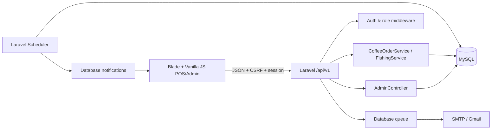
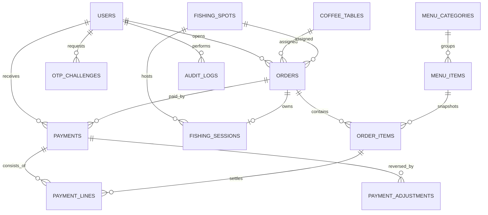

# Đồng lầy Fishing

Ứng dụng POS và quản trị vận hành cho mô hình kinh doanh kết hợp **quán cà phê** và **hồ câu cá**. Hệ thống được xây dựng bằng Laravel 13, MySQL, Blade, Vite và Vanilla JavaScript; giao diện tiếng Việt ưu tiên thao tác cảm ứng trên iPad Gen 9, đồng thời thích ứng với máy tính và điện thoại.

> Trạng thái: ứng dụng đã có đầy đủ luồng POS cốt lõi, xác thực theo vai trò, quản lý đơn, phiên câu cá, phương thức thanh toán tiền mặt/QR, thông báo, dashboard quản trị, quản lý menu/sơ đồ/người dùng, cùng bộ kiểm thử PHP và JavaScript.

## Mục lục

- [Tính năng chính](#tính-năng-chính)
- [Vai trò và đăng nhập](#vai-trò-và-đăng-nhập)
- [Nghiệp vụ POS](#nghiệp-vụ-pos)
- [Khu vực quản trị](#khu-vực-quản-trị)
- [Kiến trúc kỹ thuật](#kiến-trúc-kỹ-thuật)
- [Mô hình dữ liệu](#mô-hình-dữ-liệu)
- [Vòng đời đơn hàng và thanh toán](#vòng-đời-đơn-hàng-và-thanh-toán)
- [Yêu cầu hệ thống](#yêu-cầu-hệ-thống)
- [Cài đặt nhanh](#cài-đặt-nhanh)
- [Cấu hình môi trường](#cấu-hình-môi-trường)
- [Cấu hình SMTP Gmail và OTP](#cấu-hình-smtp-gmail-và-otp)
- [Chạy ứng dụng](#chạy-ứng-dụng)
- [Tài khoản mẫu](#tài-khoản-mẫu)
- [API](#api)
- [Queue, Scheduler và thông báo](#queue-scheduler-và-thông-báo)
- [Ảnh món và lưu trữ](#ảnh-món-và-lưu-trữ)
- [Workflow phát triển](#workflow-phát-triển)
- [Kiểm thử](#kiểm-thử)
- [Triển khai production](#triển-khai-production)
- [Sao lưu, khôi phục và làm sạch dữ liệu](#sao-lưu-khôi-phục-và-làm-sạch-dữ-liệu)
- [Xử lý sự cố](#xử-lý-sự-cố)
- [Đưa repository lên GitHub](#đưa-repository-lên-github)
- [Phạm vi hiện tại](#phạm-vi-hiện-tại)

## Tính năng chính

### POS cà phê

- Hiển thị sơ đồ 20 bàn với trạng thái trống, đang phục vụ và tạm nghỉ.
- Chạm vào bàn để mở modal gọi món.
- Tạo **đơn tại quầy** khi chưa xác định bàn; có thể chọn bàn sau.
- Thêm, giảm hoặc cập nhật số lượng món chưa thanh toán.
- Ghi chú riêng trên từng dòng món.
- Món có giá biến động được nhập giá ngay trong phiếu bán hàng, không dùng dialog trình duyệt.
- Thanh toán toàn bộ hoặc tách thanh toán theo số lượng món.
- Hiển thị rõ số lượng đã trả, số tiền đã thanh toán và số tiền còn lại.
- Gộp hóa đơn, bao gồm trường hợp một đơn đã thanh toán một phần.
- Bàn vẫn được giữ sau thanh toán cho đến khi nhân viên kết thúc/phóng bàn, tránh mất trạng thái khi khách còn ngồi.
- Giá món luôn được lấy lại từ máy chủ; tổng tiền do máy chủ tính toán.

### POS câu cá

- Quản lý 20 chòi câu.
- Mỗi phiên mặc định kéo dài **240 phút** và có giá **200.000 đ**.
- Đếm ngược thời gian phiên câu theo mốc thời gian máy chủ.
- Gia hạn trọn phiên 4 giờ hoặc theo giờ; tiền gia hạn được thêm vào đơn như dòng phí bất biến.
- Phiên đã trả trước nhưng chưa phóng chòi vẫn có thể gia hạn tiếp; phần gia hạn mới trở thành khoản chưa thanh toán.
- Chòi hết giờ vẫn được giữ cho đến khi gia hạn hoặc hoàn tất thanh toán/kết thúc phiên.
- Có thể gọi thêm món ăn, nước uống vào đơn câu cá.
- Hỗ trợ gộp hóa đơn, thanh toán tách/toàn bộ và phóng chòi.
- Scheduler đánh dấu phiên hết giờ và tạo thông báo đúng một lần.

### Đơn hàng và thanh toán

- Danh sách đơn cà phê/câu cá, lọc theo mô hình và trạng thái bằng chip/card.
- Danh sách đơn POS ưu tiên đơn vừa có hoạt động mới nhất, ví dụ bàn cũ gọi thêm món sẽ được đẩy lên trên.
- Mã đơn ngắn, dễ đọc: `CF-XXXXXX` hoặc `FS-XXXXXX`.
- Lưu snapshot tên món và đơn giá tại thời điểm gọi món.
- Lưu `ordered_at` trên từng dòng món để nhóm món theo lần gọi, giúp nhân viên xem đúng thứ tự cần pha/chế biến.
- Thanh toán tiền mặt hoặc QR/chuyển khoản theo các phương thức đang bật.
- Với tiền mặt, lưu tiền khách đưa và tiền thừa; với QR/chuyển khoản, lưu phương thức nhân viên đã xác nhận.
- Payment line bất biến giúp truy vết chính xác từng phần đã trả.
- Không xóa vật lý dữ liệu tài chính.
- Admin có thể hủy đơn hoặc đảo giao dịch kèm lý do và audit log.

### Trải nghiệm giao diện

- Giao diện tiếng Việt, tông nâu ấm, tối giản và tối ưu thao tác chạm.
- Responsive cho iPad Gen 9 xoay ngang/dọc, desktop và điện thoại.
- Sidebar theo vai trò, có thể thu gọn/mở rộng.
- Topbar dùng chung gồm đồng hồ, ngày và menu tài khoản; sự kiện vận hành được đẩy bằng toast polling ở góc trên bên phải.
- Icon được dựng bằng SVG nội tuyến.
- Modal gọi món tách vùng cuộn menu và phiếu bán hàng; vùng tổng tiền/thanh toán được giữ cố định.
- Modal thanh toán dùng bố cục phiếu hai cột giống modal gọi món, gồm side phương thức thanh toán và side phiếu thanh toán; ở iPad dọc hai modal dùng cùng chiều cao để thao tác nhất quán.
- Phiếu bán hàng dùng layout compact thống nhất cho món chưa trả, món đã trả và phí phiên câu.
- Card phiên câu tách tên phiên, giá phiên và chip lấy cá thành các dòng meta riêng; mốc bắt đầu/kết thúc trong card phiên ưu tiên hiển thị đủ thời gian và ngày tháng.
- Tab đơn hàng nhân viên ưu tiên thao tác cảm ứng: chạm trực tiếp vào hàng để mở chi tiết, ẩn bớt tổng tiền/thanh toán và tập trung vào danh sách món.
- Bảng đơn hàng dùng header sticky, vùng cuộn độc lập và phân trang tròn đồng bộ giữa POS/admin.
- Tiền hiển thị theo định dạng Việt Nam, không hiển thị số thập phân; ô tiền khách đưa tự chèn dấu phân cách hàng nghìn.
- Thông báo lỗi có nội dung mềm mại, dễ hiểu và hướng dẫn được bước tiếp theo.

## Vai trò và đăng nhập

### Quản trị viên

- Đăng nhập bằng `username` và mật khẩu.
- Chỉ tài khoản có vai trò `admin` và đang hoạt động mới được phép đăng nhập.
- Session được tái tạo sau đăng nhập để chống session fixation.
- Sau đăng nhập chuyển đến `/admin/dashboard`.

### Nhân viên

- Đăng nhập bằng email và mã OTP.
- Chỉ email đã xác minh, thuộc tài khoản `employee` đang hoạt động mới nhận OTP.
- Mã OTP được hash trong database, không lưu dạng rõ.
- OTP hết hạn sau 10 phút, tối đa 5 lần thử, chỉ dùng một lần.
- Thời gian chờ gửi lại là 60 giây.
- Phản hồi yêu cầu OTP không tiết lộ email có tồn tại hay không.
- Email OTP được đưa vào queue; queue worker phải chạy để email được gửi.
- Sau xác minh chuyển đến `/pos/coffee`.

Các endpoint xác thực được giới hạn 8 request/phút.

## Nghiệp vụ POS

### Luồng cà phê tiêu chuẩn

1. Nhân viên chọn một bàn trống hoặc bấm tạo đơn tại quầy.
2. Modal menu tải các món đang bán từ máy chủ.
3. Nhân viên chọn món, số lượng và ghi chú nếu cần.
4. Khi lưu, máy chủ khóa bản ghi bàn trong transaction và xác nhận bàn chưa có đơn hoạt động.
5. Đơn mới chuyển sang trạng thái `open`; bàn chuyển sang đang phục vụ.
6. Các lần cập nhật sau phải gửi đúng `version` hiện tại của đơn.
7. Nếu hai thiết bị sửa cùng lúc, yêu cầu cũ bị từ chối và giao diện yêu cầu tải lại dữ liệu mới.
8. Nhân viên có thể thanh toán một phần hoặc toàn bộ.
9. Khi mọi số lượng đã được trả, đơn chuyển sang `paid`; bàn chỉ trống lại khi được phóng hoặc khi checkout yêu cầu tự động phóng.

### Đơn tại quầy

- Đơn có thể được tạo mà không có `coffee_table_id`.
- Khi biết vị trí khách, nhân viên gán bàn từ phiếu bán hàng.
- Máy chủ từ chối nếu bàn đích đang có đơn hoạt động.
- Đơn vẫn có thể thanh toán mà không cần gán bàn.

### Luồng câu cá tiêu chuẩn

1. Nhân viên chọn chòi trống và bắt đầu phiên.
2. Máy chủ khóa chòi, tạo order, fishing session và dòng phí 4 giờ.
3. `ends_at` được tính từ thời gian máy chủ.
4. Giao diện render đồng hồ mỗi giây, đồng bộ trạng thái từ API theo chu kỳ.
5. Gia hạn có thể cộng thêm một block 240 phút hoặc 1-3 giờ; mỗi lần tạo/cập nhật dòng phí gia hạn tương ứng trong đơn.
6. Scheduler đổi phiên sang `expired` khi hết giờ và tạo thông báo.
7. Chòi hết giờ hoặc đã thanh toán trước vẫn bị chiếm cho đến khi gia hạn tiếp hoặc phóng chòi/kết thúc đơn.

### Tách thanh toán

- Client gửi danh sách `order_item_id` và số lượng cần thanh toán.
- Máy chủ kiểm tra số lượng chưa trả, đơn giá snapshot và phiên bản đơn.
- Một `payment` và các `payment_lines` tương ứng được tạo trong transaction.
- `paid_quantity` trên dòng món được cập nhật.
- Đơn ở trạng thái `partially_paid` nếu còn món chưa trả; `paid` khi đã trả hết.
- Tiền khách đưa phải lớn hơn hoặc bằng số tiền của lần thanh toán hiện tại.

### Gộp hóa đơn

- Chỉ gộp các đơn phù hợp cùng mô hình.
- Dòng món và lịch sử thanh toán được giữ lại để đối soát.
- Nếu đơn nguồn đã thanh toán một phần, đơn đích sau gộp phản ánh đúng phần đã thu và phần còn phải trả.
- Thao tác được thực hiện trong transaction và phát thông báo POS.

## Khu vực quản trị

Admin chỉ tập trung vào quản lý, không hiển thị các mục vận hành cà phê/câu cá của nhân viên.

### Tổng quan kinh doanh

- Bộ lọc khoảng ngày.
- Doanh thu thực thu và so sánh kỳ trước.
- Số đơn hoàn tất, giá trị trung bình và khoản còn phải thu.
- Doanh thu cà phê/câu cá theo ngày.
- Hiệu quả mô hình cà phê: doanh thu, đơn hoàn tất, số sản phẩm, món đóng góp nhiều nhất.
- Hiệu quả mô hình câu cá: doanh thu, số phiên, thời lượng trung bình, tỷ lệ sử dụng chòi.
- Khung giờ cao điểm, hiệu suất thu ngân và các chỉ số hủy/đối soát.
- Biểu đồ native SVG, không phụ thuộc thư viện chart phía ngoài.

### Quản lý đơn hàng

- Xem đơn hiện tại và lịch sử.
- Lọc theo mô hình và trạng thái bằng segmented/chip giống ngôn ngữ POS.
- Click trực tiếp vào hàng để mở chi tiết đơn; không cần bấm nút riêng.
- Header bảng sticky, bảng cuộn độc lập và phân trang tròn.
- Xem chi tiết dòng món, tổng tiền, phần đã trả, phần còn lại và giao dịch.
- Hủy đơn kèm lý do.
- Đảo giao dịch thanh toán bằng adjustment có audit trail.

### Quản lý menu

- Lọc nhóm món bằng chip giống modal order và tìm kiếm theo tên món.
- Bảng menu cuộn độc lập, giữ bo góc và dùng phân trang tròn.
- Click trực tiếp vào hàng để mở modal chỉnh sửa món.
- Tạo một hoặc nhiều món trong cùng một lần.
- Chọn nhóm món hiện có hoặc tạo nhóm mới ngay trong form.
- Gợi ý các nhóm đang hoạt động và đã có món.
- Mỗi batch tối đa 20 món; toàn bộ batch được lưu trong một transaction.
- Giá giao dịch dạng số và nhãn giá hiển thị tùy chọn như `30.000 - 50.000 đ`.
- Upload ảnh JPG, PNG hoặc WebP tối đa 30 MB; chấp nhận nhiều tỷ lệ ảnh và hiển thị bằng vùng crop an toàn.
- Bật/tắt tình trạng đang bán.
- Soft delete món.
- Không cho lưu trữ món đang được tham chiếu bởi đơn chưa hoàn tất.

### Quản lý sơ đồ

- Giao diện bàn/chòi đồng bộ với POS.
- Hiển thị bàn/chòi đang được dùng dựa trên dữ liệu đơn POS hiện tại.
- Chọn bàn hoặc chòi để sửa nhãn và trạng thái sử dụng.
- Quản lý vị trí chuẩn hóa X/Y, giúp sơ đồ thích ứng theo kích thước màn hình.
- Thêm/xóa slot khi nghiệp vụ cho phép.

### Quản lý người dùng

- Tạo và chỉnh sửa tài khoản.
- Gán vai trò `admin` hoặc `employee`.
- Bật/tắt tài khoản.
- Quản lý trạng thái xác minh email nhân viên.
- Đặt lại mật khẩu quản trị viên.

### Quản lý thanh toán

- Quản lý các phương thức thanh toán hiển thị trên POS.
- Mặc định có tiền mặt; có thể thêm nhiều phương thức QR/chuyển khoản.
- Bật/tắt từng phương thức; POS chỉ hiển thị phương thức đang bật và đủ cấu hình.
- Với QR/chuyển khoản, lưu ảnh QR, ngân hàng/ví điện tử, tên chủ tài khoản, số tài khoản, nội dung chuyển khoản và ghi chú hướng dẫn.
- POS hiển thị mã QR theo phương thức được chọn, với thông tin chủ tài khoản và số tài khoản được rút gọn dưới mã để nhân viên dễ đối chiếu.
- Ảnh QR hỗ trợ JPG, PNG hoặc WebP tối đa 30 MB.
- Các thay đổi phương thức thanh toán được ghi audit log.

## Kiến trúc kỹ thuật

### Công nghệ

| Thành phần | Công nghệ |
| --- | --- |
| Backend | PHP 8.3+, Laravel 13 |
| Frontend | Blade, HTML5, CSS3, Vanilla JavaScript ES modules |
| Bundler | Vite 8 |
| Database | MySQL 8+, `utf8mb4` |
| Auth | Laravel session + CSRF |
| Queue | Laravel database queue |
| Scheduler | Laravel Scheduler |
| Email | Laravel Mail, SMTP Gmail tương thích |
| Testing | PHPUnit 12, Node.js built-in test runner |

### Sơ đồ thành phần



### Cấu trúc thư mục quan trọng

```text
app/
├── Http/Controllers/          # Auth, POS, orders, notifications, admin API
├── Http/Middleware/           # Phân quyền theo role
├── Mail/                      # Email OTP
├── Models/                    # Eloquent models
├── Notifications/            # Hết giờ câu và sự kiện POS
└── Services/                  # Transaction và nghiệp vụ cà phê/câu cá
bootstrap/                     # Bootstrap Laravel
config/                        # Cấu hình ứng dụng, database, mail, fishing
database/
├── migrations/               # Toàn bộ schema
└── seeders/                   # Admin, nhân viên, 20 bàn/chòi, menu mẫu
public/                        # Entry point và asset public
resources/
├── css/app.css               # Design system và responsive UI
├── js/app.js                 # UI/application orchestration
├── js/modules/               # API, cart, format, modal, timers
└── views/                    # Login và Blade shell
routes/
├── web.php                   # Trang + API v1
└── console.php               # Scheduler hết giờ câu
storage/                       # Log, queue/runtime và file upload local
tests/Feature/                # Kiểm thử authentication, POS, admin
```

## Mô hình dữ liệu



### Bảng nghiệp vụ

| Bảng | Mục đích |
| --- | --- |
| `users` | Tài khoản, vai trò, trạng thái, username/email/mật khẩu |
| `otp_challenges` | OTP đã hash, hạn dùng, số lần thử và thời điểm sử dụng |
| `coffee_tables` | Bàn cà phê, nhãn, tọa độ chuẩn hóa, trạng thái bật/tắt |
| `fishing_spots` | Chòi câu, nhãn, tọa độ chuẩn hóa, trạng thái bật/tắt |
| `menu_categories` | Nhóm món, thứ tự và trạng thái hoạt động |
| `menu_items` | Món, giá, giá hiển thị, ảnh, tình trạng bán và soft delete |
| `orders` | Đơn cà phê/câu cá, vị trí, trạng thái, snapshot tổng và version |
| `order_items` | Snapshot tên/giá, số lượng, số lượng đã trả và ghi chú |
| `fishing_sessions` | Bắt đầu/kết thúc, số block 4 giờ và trạng thái phiên |
| `payments` | Giao dịch tiền mặt bất biến |
| `payment_lines` | Phân bổ giao dịch đến từng dòng món |
| `payment_adjustments` | Điều chỉnh/đảo thanh toán có lý do |
| `payment_qr_settings` | Phương thức thanh toán tiền mặt/QR, thông tin nhận tiền và ảnh QR |
| `audit_logs` | Nhật ký thao tác quản trị nhạy cảm |
| `notifications` | Thông báo database cho người dùng |

Ngoài ra Laravel sử dụng `sessions`, `cache`, `jobs`, `failed_jobs`, `job_batches` và `password_reset_tokens`.

## Vòng đời đơn hàng và thanh toán

Các trạng thái chính:

```text
open ── thanh toán một phần ──> partially_paid
  │                                │
  └──── thanh toán toàn bộ ────────┴──> paid ── phóng bàn/chòi ──> completed
  └──────────────────── admin hủy ────> voided
```

- Mọi mutation quan trọng được bọc trong database transaction.
- `lockForUpdate()` bảo vệ việc nhận cùng một bàn/chòi từ nhiều thiết bị.
- Trường `version` ngăn client cũ ghi đè dữ liệu mới.
- Chỉ các dòng/số lượng chưa thanh toán mới được sửa.
- Giá client gửi lên không được tin cậy; máy chủ dùng giá menu hoặc snapshot hợp lệ.
- Bản ghi tài chính không bị xóa vật lý.

## Yêu cầu hệ thống

- PHP `8.3+` và các extension phổ biến của Laravel: `ctype`, `curl`, `dom`, `fileinfo`, `filter`, `hash`, `mbstring`, `openssl`, `pdo`, `pdo_mysql`, `session`, `tokenizer`, `xml`.
- Composer 2.
- Node.js 20+ và npm.
- MySQL 8+ hoặc MariaDB tương thích MySQL strict mode.
- Một tài khoản SMTP nếu cần gửi OTP thật.
- Khuyến nghị macOS/Linux; Windows nên dùng WSL2.

Kiểm tra nhanh:

```bash
php -v
composer --version
node -v
npm -v
mysql --version
```

## Cài đặt nhanh

### 1. Lấy source và cài dependency

```bash
git clone <repository-url> donglay-fishing
cd donglay-fishing
composer install
npm install
cp .env.example .env
php artisan key:generate
```

### 2. Tạo database

```bash
mysql -u root -p -e "CREATE DATABASE donglay_fishing CHARACTER SET utf8mb4 COLLATE utf8mb4_unicode_ci;"
```

Nếu MySQL local không có mật khẩu root, bỏ `-p`.

### 3. Sửa `.env`

```dotenv
DB_CONNECTION=mysql
DB_HOST=127.0.0.1
DB_PORT=3306
DB_DATABASE=donglay_fishing
DB_USERNAME=root
DB_PASSWORD=
```

### 4. Tạo bảng và dữ liệu mẫu

```bash
php artisan migrate --seed
php artisan storage:link
```

### 5. Build frontend

```bash
npm run build
```

### 6. Khởi động

```bash
composer dev
```

Mở [http://localhost:8000](http://localhost:8000).

> `composer setup` có thể tự động hóa phần lớn bước cài dependency, tạo `.env`, generate key, migrate và build. Database vẫn phải tồn tại và thông tin kết nối phải đúng trước khi chạy migration.

## Cấu hình môi trường

Không commit `.env`. File này có thể chứa khóa ứng dụng, mật khẩu database và SMTP.

### Ứng dụng

```dotenv
APP_NAME="Đồng lầy Fishing"
APP_ENV=local
APP_DEBUG=true
APP_URL=http://localhost:8000
APP_LOCALE=vi
```

Timezone được cố định tại `Asia/Ho_Chi_Minh` trong `config/app.php`.

### Session, cache và queue

```dotenv
SESSION_DRIVER=database
CACHE_STORE=database
QUEUE_CONNECTION=database
```

Các bảng tương ứng được tạo bởi migration có sẵn.

### Cấu hình phiên câu

`config/fishing.php`:

```php
return [
    'session_minutes' => 240,
    'session_price' => 200000.00,
    'hourly_extension_price' => 50000.00,
];
```

Thay đổi các giá trị này chỉ nên thực hiện sau khi đánh giá ảnh hưởng đến đơn đang mở. Dòng phí cũ vẫn giữ snapshot giá tại thời điểm tạo.

## Cấu hình SMTP Gmail và OTP

### Chuẩn bị Gmail

1. Bật xác minh hai bước cho tài khoản Google.
2. Tạo **App password** dành cho ứng dụng POS.
3. Không dùng mật khẩu Gmail thông thường.
4. Không commit app password vào Git.

### `.env`

```dotenv
MAIL_MAILER=smtp
MAIL_SCHEME=smtp
MAIL_HOST=smtp.gmail.com
MAIL_PORT=587
MAIL_USERNAME="your-account@gmail.com"
MAIL_PASSWORD="your-16-character-app-password"
MAIL_FROM_ADDRESS="your-account@gmail.com"
MAIL_FROM_NAME="${APP_NAME}"
```

Sau khi sửa cấu hình:

```bash
php artisan optimize:clear
php artisan queue:restart
```

Chạy worker:

```bash
php artisan queue:work --tries=3
```

Kiểm tra job lỗi:

```bash
php artisan queue:failed
php artisan queue:retry all
```

Trong môi trường không có SMTP, có thể dùng:

```dotenv
MAIL_MAILER=log
```

Khi đó nội dung OTP xuất hiện trong `storage/logs/laravel.log`; chỉ dùng cách này khi phát triển local.

## Chạy ứng dụng

### Cách khuyến nghị khi phát triển

```bash
composer dev
```

Lệnh này chạy song song:

- PHP server tại `127.0.0.1:8000` với giới hạn upload 30 MB.
- Queue listener.
- Scheduler worker.
- Laravel Pail để xem log.
- Vite development server.

### Chạy từng tiến trình riêng

Terminal 1:

```bash
php -d upload_max_filesize=30M -d post_max_size=120M artisan serve
```

Terminal 2:

```bash
npm run dev
```

Terminal 3:

```bash
php artisan queue:work --tries=3
```

Terminal 4:

```bash
php artisan schedule:work
```

## Tài khoản mẫu

Seeder tạo:

| Vai trò | Thông tin đăng nhập |
| --- | --- |
| Admin | Username `admin`, mật khẩu `Admin@12345` |
| Nhân viên | Email `nhanvien@donglay.local`, đăng nhập OTP |

Seeder đồng thời tạo 20 bàn, 20 chòi và 8 món mẫu thuộc các nhóm Cà phê, Trà, Nước và Đồ ăn.

> Bắt buộc đổi mật khẩu admin, email nhân viên và xóa dữ liệu mẫu trước khi dùng thật.

## API

Tất cả JSON API dùng prefix `/api/v1`, session authentication và CSRF cùng origin.

### Xác thực và tài khoản

| Method | Endpoint | Mô tả |
| --- | --- | --- |
| `POST` | `/auth/admin` | Admin đăng nhập bằng username/password |
| `POST` | `/auth/otp/request` | Yêu cầu OTP nhân viên |
| `POST` | `/auth/otp/verify` | Xác minh OTP |
| `GET` | `/profile` | Hồ sơ phiên hiện tại |
| `POST` | `/logout` | Đăng xuất |

### Thông báo

| Method | Endpoint | Mô tả |
| --- | --- | --- |
| `GET` | `/notifications` | Danh sách và số chưa đọc |
| `POST` | `/notifications/{id}/read` | Đánh dấu một thông báo đã đọc |
| `POST` | `/notifications/read-all` | Đọc tất cả |
| `POST` | `/notifications/delete-all` | Xóa danh sách thông báo của người dùng |

### POS cà phê

| Method | Endpoint | Mô tả |
| --- | --- | --- |
| `GET` | `/coffee/map` | Trạng thái bàn và menu |
| `POST` | `/coffee/orders` | Tạo đơn tại quầy |
| `POST` | `/coffee/tables/{table}/orders` | Tạo đơn tại bàn |
| `PUT` | `/coffee/orders/{order}` | Cập nhật món chưa trả |
| `PUT` | `/coffee/orders/{order}/table` | Gán/chuyển bàn |
| `POST` | `/coffee/orders/{order}/checkout` | Thanh toán tách/toàn bộ |
| `POST` | `/coffee/orders/{order}/merge` | Gộp hóa đơn |
| `POST` | `/coffee/orders/{order}/release` | Phóng bàn/kết thúc đơn |

### POS câu cá

| Method | Endpoint | Mô tả |
| --- | --- | --- |
| `GET` | `/fishing/map` | Trạng thái chòi, timer và menu |
| `POST` | `/fishing/spots/{spot}/start` | Bắt đầu phiên 4 giờ |
| `POST` | `/fishing/orders/{order}/extend` | Gia hạn trọn phiên hoặc theo giờ |
| `PUT` | `/fishing/orders/{order}` | Cập nhật món gọi thêm |
| `POST` | `/fishing/orders/{order}/merge` | Gộp hóa đơn |
| `POST` | `/fishing/orders/{order}/checkout` | Thanh toán |
| `POST` | `/fishing/orders/{order}/release` | Phóng chòi/kết thúc phiên |

### Đơn hàng

| Method | Endpoint | Mô tả |
| --- | --- | --- |
| `GET` | `/orders` | Danh sách/lọc đơn |
| `GET` | `/orders/{order}` | Chi tiết đơn |

### Admin

| Method | Endpoint | Mô tả |
| --- | --- | --- |
| `GET` | `/admin/dashboard` | Analytics theo khoảng ngày |
| `GET/POST` | `/admin/menu` | Danh sách/tạo một món |
| `POST` | `/admin/menu/batch` | Tạo nhiều món cùng nhóm |
| `PUT/DELETE` | `/admin/menu/{item}` | Sửa/lưu trữ món |
| `GET/PUT/POST` | `/admin/map` | Đọc/cập nhật/thêm slot sơ đồ |
| `DELETE` | `/admin/map/{type}/{id}` | Xóa slot |
| `GET/POST` | `/admin/payment-settings` | Đọc/cập nhật cấu hình QR mặc định |
| `POST` | `/admin/payment-methods` | Thêm phương thức thanh toán |
| `POST/PUT` | `/admin/payment-methods/{paymentMethod}` | Cập nhật phương thức thanh toán |
| `GET/POST` | `/admin/users` | Danh sách/tạo user |
| `PUT` | `/admin/users/{user}` | Cập nhật user |
| `POST` | `/admin/orders/{order}/void` | Hủy đơn có lý do |
| `POST` | `/admin/payments/{payment}/reverse` | Đảo giao dịch có lý do |

## Queue, Scheduler và thông báo

### Queue

OTP email được queue để request đăng nhập không phải chờ SMTP. Production cần một process manager giữ worker hoạt động:

```bash
php artisan queue:work --sleep=1 --tries=3 --timeout=90
```

### Scheduler

Tác vụ `expire-fishing-sessions` chạy mỗi phút:

- Tìm phiên `active` có `ends_at <= now()`.
- Khóa bản ghi trong transaction.
- Bỏ qua phiên đã thông báo hoặc không còn active.
- Đổi trạng thái thành `expired`.
- Ghi `expired_notified_at`.
- Gửi database notification cho người dùng đang hoạt động.

Production có thể dùng một trong hai cách:

```bash
php artisan schedule:work
```

hoặc cron:

```cron
* * * * * cd /path/to/donglay-fishing && php artisan schedule:run >> /dev/null 2>&1
```

Không chạy đồng thời nhiều cơ chế scheduler nếu chưa có chủ đích. Tác vụ đã dùng `withoutOverlapping()` và kiểm tra idempotent.

### Sự kiện thông báo POS

Hệ thống tạo thông báo cho các sự kiện chính: đơn mới, gọi thêm/cập nhật món, gán bàn, thanh toán, gộp bill, kết thúc bàn/chòi, bắt đầu phiên, gia hạn và hết giờ câu.

Frontend polling thông báo khoảng mỗi 3 giây, hiển thị bằng toast lớn ở góc trên bên phải và tự đánh dấu đã đọc khi phù hợp. Khi có sự kiện mới, danh sách đơn POS/Admin và sơ đồ admin được làm mới nhẹ để nhân viên/quản trị không phải reload trang.

## Ảnh món và lưu trữ

- Định dạng: JPEG/JPG, PNG, WebP.
- Kích thước tối đa: 30 MB mỗi ảnh.
- Chấp nhận ảnh ngang, dọc hoặc vuông; UI crop bằng `object-fit` để card đồng nhất.
- File được lưu trên disk public và đường dẫn nằm trong `menu_items.image_path`.
- Ảnh QR phương thức thanh toán dùng cùng disk public, lưu trong `payment-qr/` và đường dẫn nằm trong `payment_qr_settings.qr_image_path`.

Tạo symbolic link:

```bash
php artisan storage:link
```

Kiểm tra cấu hình PHP:

```bash
php -i | grep -E 'upload_max_filesize|post_max_size|max_file_uploads'
```

Project có `php.ini` tham chiếu với:

```ini
upload_max_filesize=30M
post_max_size=120M
max_file_uploads=20
```

Nếu dùng Nginx, đặt thêm:

```nginx
client_max_body_size 120M;
```

Nếu dùng PHP-FPM, phải sửa đúng `php.ini` của FPM rồi restart service. Giá trị PHP CLI và PHP-FPM có thể khác nhau.

`storage/app/public/*` và `public/storage` không được commit. Production phải dùng persistent storage và có chiến lược backup file ảnh.

## Workflow phát triển

Repo này đang được tinh chỉnh liên tục theo ảnh/test thực tế tại quán, đặc biệt ở POS iPad/mobile và màn admin. Khi sửa, ưu tiên nhịp làm việc gọn:

- Trước khi sửa: xem `git status`, đọc đúng đoạn source liên quan và kiểm tra diff nếu file đang có thay đổi cũ.
- Sửa đúng phạm vi yêu cầu, bám pattern sẵn có trong `resources/js/app.js`, `resources/css/app.css`, service/controller Laravel và test hiện tại.
- Sau mỗi thay đổi chỉ chạy kiểm tra nhanh đủ liên quan: tài liệu thì `git diff --check -- README.md`; CSS/JS thì `npm run build`; module JS thì `npm test`; backend/nghiệp vụ thì chạy đúng filter test nhỏ như `php artisan test --filter=PosWorkflowTest`.
- Browser/UI check chỉ cần dùng khi thay đổi có rủi ro vỡ layout hoặc luồng chạm; kiểm thử sâu từng màn để chủ dự án tự test thực tế.
- Khi commit, chỉ stage file thuộc phạm vi thay đổi hiện tại, tránh kéo theo các file đang dở ở worktree.

## Kiểm thử

Nhịp mặc định cho dự án là test vừa đủ theo phạm vi sửa. Các lệnh dưới đây dùng khi cần kiểm đầy đủ hơn.

### Chạy toàn bộ

```bash
composer test
npm test
npm run build
```

### PHP feature tests

```bash
php artisan test
```

Bộ test bao phủ:

- Admin login, OTP một lần, tài khoản bị vô hiệu hóa.
- Tạo đơn cà phê, đơn tại quầy, gán bàn và chống tranh chấp bàn.
- Optimistic version và stale update.
- `ordered_at` trên dòng món để nhóm đơn theo lần gọi trong modal nhân viên.
- Tách thanh toán, thanh toán cuối, tự động/phóng bàn thủ công.
- Thanh toán QR/chuyển khoản và quản lý nhiều phương thức thanh toán từ admin.
- Danh sách đơn ưu tiên hoạt động mới nhất.
- Phiên câu, gọi thêm món, gia hạn theo block hoặc theo giờ, hết giờ và notification idempotent.
- Gộp đơn cà phê/câu cá và trường hợp paid + unpaid.
- Ghi chú dòng món.
- Quy tắc xóa menu đang được sử dụng.
- Upload/thay ảnh, nhiều tỷ lệ ảnh, giới hạn 30 MB.
- Batch menu, nhóm hiện có/nhóm mới và tính atomic khi validation lỗi.
- Dashboard doanh thu thực thu, khoản còn lại và thống kê hủy.
- Điều hướng quản trị không chứa module vận hành.

### JavaScript unit tests

```bash
npm test
```

Bao phủ cart state, định dạng số không có phần thập phân, định dạng tiền nhập theo hàng nghìn và countdown không âm.

### Build production assets

```bash
npm run build
```

## Triển khai production

### Checklist

1. Dùng PHP 8.3+, MySQL 8 strict mode, HTTPS và document root trỏ đến `public/`.
2. Cài dependency production:

   ```bash
   composer install --no-dev --optimize-autoloader
   npm ci
   npm run build
   ```

3. Cấu hình `.env`:

   ```dotenv
   APP_ENV=production
   APP_DEBUG=false
   APP_URL=https://pos.example.com
   SESSION_SECURE_COOKIE=true
   ```

4. Tạo database/user riêng, không dùng root.
5. Chạy migration:

   ```bash
   php artisan migrate --force
   php artisan storage:link
   ```

6. Cấu hình SMTP và kiểm tra queue.
7. Chạy queue worker bằng Supervisor/systemd.
8. Chạy scheduler bằng cron hoặc service riêng.
9. Cache cấu hình:

   ```bash
   php artisan optimize
   ```

10. Đảm bảo web server có quyền ghi `storage/` và `bootstrap/cache/`.
11. Thiết lập backup MySQL và `storage/app/public`.
12. Đổi/xóa toàn bộ tài khoản và dữ liệu mẫu.
13. Theo dõi `storage/logs/laravel.log` và bảng `failed_jobs`.

### Quyền thư mục tham khảo

```bash
chmod -R ug+rw storage bootstrap/cache
```

Không dùng `chmod -R 777` trên production.

### Sau mỗi lần deploy

```bash
php artisan migrate --force
php artisan optimize
php artisan queue:restart
```

## Sao lưu, khôi phục và làm sạch dữ liệu

### Export MySQL

```bash
mysqldump -u root -p --single-transaction --routines --triggers donglay_fishing > donglay_fishing.sql
```

### Import

```bash
mysql -u root -p donglay_fishing < donglay_fishing.sql
```

### Xem database trong terminal

```bash
mysql -u root -p donglay_fishing
```

Một số lệnh MySQL hữu ích:

```sql
SHOW TABLES;
DESCRIBE orders;
SELECT id, order_number, service_type, status, total FROM orders ORDER BY id DESC LIMIT 20;
EXIT;
```

### Reset toàn bộ dữ liệu local

> Cảnh báo: lệnh sau xóa toàn bộ bảng và dữ liệu hiện tại, sau đó tạo lại schema và dữ liệu mẫu. Không dùng trên production.

```bash
php artisan migrate:fresh --seed
```

Nếu cần xóa riêng dữ liệu giao dịch nhưng giữ người dùng/sơ đồ, hãy backup trước và thực hiện bằng transaction/script bảo trì có kiểm tra foreign key. Không xóa thủ công các payment hoặc audit record trên hệ thống đang vận hành.

## Xử lý sự cố

### Không nhận được OTP

1. Kiểm tra nhân viên tồn tại, `is_active = 1`, role là `employee`, email đã xác minh.
2. Kiểm tra queue worker đang chạy.
3. Kiểm tra:

   ```bash
   php artisan queue:failed
   tail -f storage/logs/laravel.log
   ```

4. Xóa cache cấu hình sau khi sửa SMTP:

   ```bash
   php artisan optimize:clear
   php artisan queue:restart
   ```

5. Kiểm tra Gmail App Password, port 587 và TLS/firewall của server.

### Upload ảnh lỗi

- Kiểm tra ảnh thuộc JPEG/PNG/WebP và nhỏ hơn hoặc bằng 30 MB.
- Kiểm tra `upload_max_filesize`, `post_max_size`, Nginx `client_max_body_size` và proxy/CDN limit.
- Chạy `php artisan storage:link`.
- Kiểm tra quyền ghi `storage/app/public`.
- Nếu món không ảnh lưu được nhưng món có ảnh lỗi, thường request đã bị chặn ở PHP/web server trước Laravel.

### Ảnh không hiển thị

```bash
php artisan storage:link
ls -la public/storage
```

Đảm bảo `APP_URL` đúng domain/protocol production.

### Phiên câu không báo hết giờ

- Kiểm tra scheduler đang chạy.
- Chạy thử:

  ```bash
  php artisan schedule:list
  php artisan schedule:run
  ```

- Kiểm tra timezone hệ thống và `Asia/Ho_Chi_Minh`.

### Gặp thông báo dữ liệu đã thay đổi

Đây là bảo vệ optimistic locking. Một thiết bị khác đã cập nhật đơn trước. Đóng/mở lại đơn hoặc tải lại trạng thái mới rồi thao tác tiếp.

### Lỗi 419 / CSRF

- Truy cập frontend và API cùng origin.
- Không gọi API mutation khi chưa lấy session/CSRF cookie hợp lệ.
- Kiểm tra `APP_URL`, `SESSION_DOMAIN`, HTTPS và secure cookie.

### Vite manifest không tồn tại

```bash
npm install
npm run build
```

Hoặc khi phát triển, chạy `npm run dev`.

## Đưa repository lên GitHub

Sau khi local repository đã có commit:

```bash
git remote add origin https://github.com/<username>/<repository>.git
git push -u origin main
```

Hoặc dùng SSH:

```bash
git remote add origin git@github.com:<username>/<repository>.git
git push -u origin main
```

Kiểm tra trước khi push:

```bash
git status
git remote -v
git log --oneline -5
```

Các file nhạy cảm/runtime đã được `.gitignore` loại trừ, gồm `.env`, dependency, build output, database SQLite, log, cache, upload local và symbolic link storage. Tuy vậy, luôn rà lại staged files trước mỗi commit.

## Phạm vi hiện tại

Ứng dụng hiện giả định:

- Thanh toán tiền mặt và QR/chuyển khoản được nhân viên xác nhận thủ công.
- Không VAT/thuế, giảm giá, tồn kho, loyalty hoặc payment gateway tự động.
- Không in bếp/in hóa đơn phần cứng.
- Không tự phát sinh phí quá giờ; mọi khoản gia hạn do nhân viên chọn trọn phiên hoặc theo giờ.
- Không tự tái chiếm bàn/chòi khi admin đảo một thanh toán đã hoàn tất.
- Email OTP dùng SMTP; production cần thông tin SMTP thật và worker ổn định.

Các mở rộng phù hợp trong tương lai: phân ca/két tiền, đối soát ngân hàng tự động, in bếp, tồn kho nguyên liệu, báo cáo chi phí/lợi nhuận, phân quyền chi tiết, export Excel/PDF và audit dashboard.

## Bảo mật và nguyên tắc vận hành

- Không commit `.env`, app password Gmail, database dump hoặc khóa production.
- Đổi thông tin seed ngay khi bàn giao.
- Chỉ chạy ứng dụng qua HTTPS ở production.
- Giới hạn quyền database user theo nguyên tắc tối thiểu.
- Backup định kỳ và kiểm tra khả năng restore.
- Không sửa trực tiếp snapshot giá, payment line hoặc audit log trong database.
- Mọi hủy/đảo giao dịch phải có lý do nghiệp vụ.
- Theo dõi failed queue, log ứng dụng và dung lượng storage.

## Giấy phép

Mã nguồn hiện khai báo giấy phép MIT trong `composer.json`. Khi bàn giao hoặc phát hành công khai, hãy bổ sung file `LICENSE` và xác nhận lại quyền sở hữu mã nguồn, hình ảnh món và tài sản thương hiệu.
